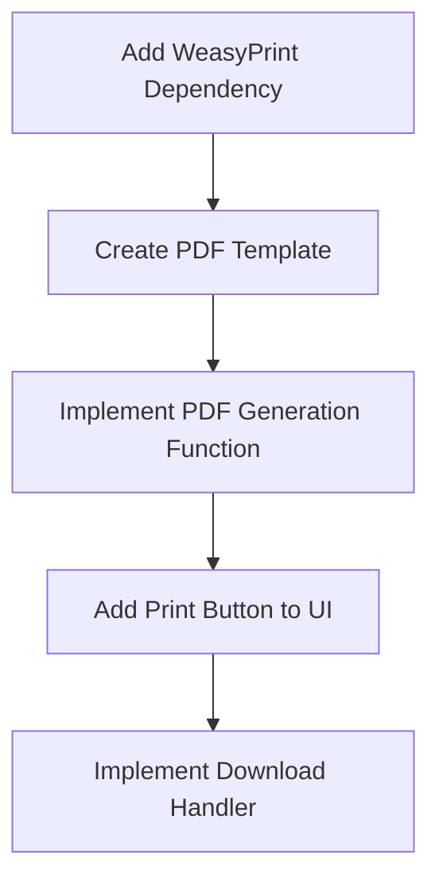

# PDF Export Implementation Plan

## Overview
Add a "Print" button to the NiceGUI application that generates a styled PDF with company branding using WeasyPrint.



## Phase 1: Add WeasyPrint Dependency
- Update `pyproject.toml` to include WeasyPrint and Jinja2
- Example addition to `pyproject.toml`:
```toml
dependencies = [
    "nicegui>=2.17.0",
    "weasyprint",
    "jinja2",
]
```

## Phase 2: Create PDF Template
- Create directory: `templates/`
- Create file: `templates/pdf_template.html`
- Template content:
```html
<!DOCTYPE html>
<html>
<head>
    <style>
        /* Branding styles */
        .header { background-color: #2c3e50; color: white; }
        .footer { background-color: #ecf0f1; }
        /* Table styles */
        table { width: 100%; border-collapse: collapse; }
        th { background-color: #3498db; color: white; }
    </style>
</head>
<body>
    <div class="header">
        <h1>Company Name</h1>
        
    </div>
    
    <table>
        <thead>
            <tr>
                
                <th>{{ col.label }}</th>
                
            </tr>
        </thead>
        <tbody>
            
            <tr>
                
                <td>{{ row[col.name] }}</td>
                
            </tr>
            
        </tbody>
    </table>
    
    <div class="footer">
        <p>Generated on {{ timestamp }}</p>
    </div>
</body>
</html>
```

## Phase 3: Implement PDF Generation Function
- Add the following function to `main.py`:
```python
from weasyprint import HTML
from jinja2 import Environment, FileSystemLoader
import datetime

def generate_pdf():
    env = Environment(loader=FileSystemLoader('templates'))
    template = env.get_template('pdf_template.html')
    
    html_out = template.render(
        columns=columns,
        rows=table.rows,
        timestamp=datetime.datetime.now().strftime("%Y-%m-%d %H:%M")
    )
    
    return HTML(string=html_out).write_pdf()
```

## Phase 4: Add Print Button to UI
- Modify the button row in `main.py` to add a new button:
```python
with ui.row():
    ui.button('Izbrisi sve', on_click=delete_all_rows)
    ui.button('Natisni PDF', on_click=generate_and_download_pdf)  # New button
```

## Phase 5: Implement Download Handler
- Add the following function to `main.py`:
```python
def generate_and_download_pdf():
    if not table.rows:
        ui.notify("Tabela je prazna. Najprej dodajte podatke.")
        return

    try:
        pdf_bytes = generate_pdf()
        ui.download(pdf_bytes, "window_calculations.pdf", "application/pdf")
    except Exception as e:
        ui.notify(f"Napaka pri generiranju PDF: {e}")
```

## Additional Considerations
1. **Error Handling**: Added try/except and empty table check
2. **Branding Assets**: Need company logo (logo.png) in templates directory
3. **Dependency Installation**: Run `uv pip install` after updating pyproject.toml

## Open Questions
1. What company name should appear in the PDF header?
2. Do you have a logo file (logo.png) to use, or should we create a placeholder?
3. Should the PDF include additional information beyond the table?